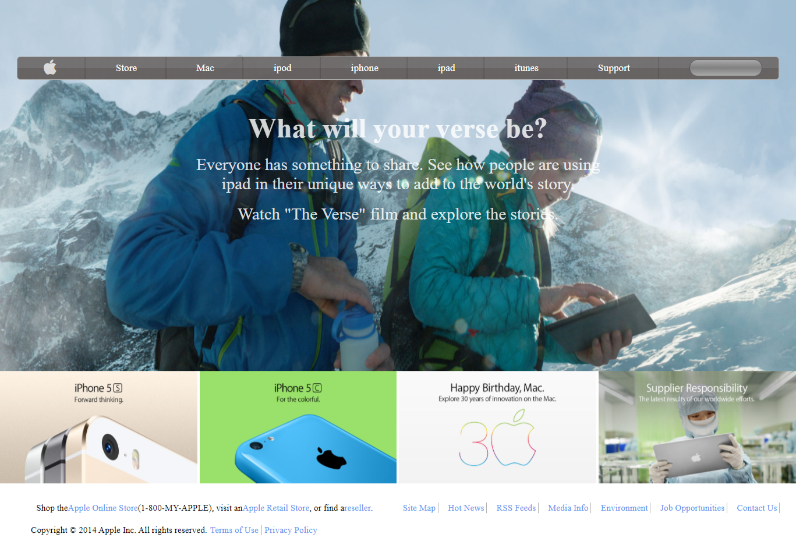

# HTML & CSS: Background Gradient

I did the background gradient project from the odin project and this was the end product.

The project involves cloning apple.com page. I tried to mimic the background gradient of the page and in the process I learned how to go about background gradients.

## Built with

- HTML
- CSS

## Live Demo

[background gradient](https://garang96.github.io/background-gradient/)

## Authors

**John Alier Garang**

- Github: [@garang96](https://github.com/garang96)

## Contributing

Contributions,issues,and feature requests are welcomed!

Feel free to check the [issues page](https://rawcdn.githack.com/garang96/background-gradient/tree/gradient)

## Show your support

Give a star if you like this project!

## Acknowledgements

* Big up to the Odin Project for providing a wonderful platform for doing projects.

## License

This project is [MIT](https://rawcdn.githack.com/garang96/background-gradient/tree/gradient) licensed.

